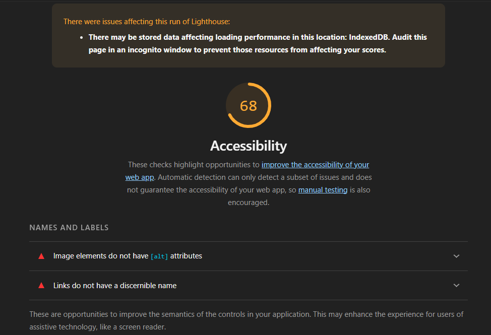
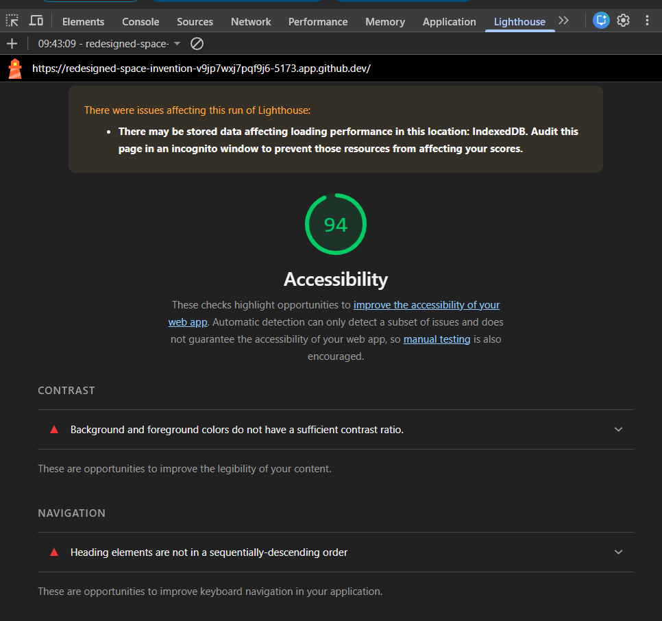
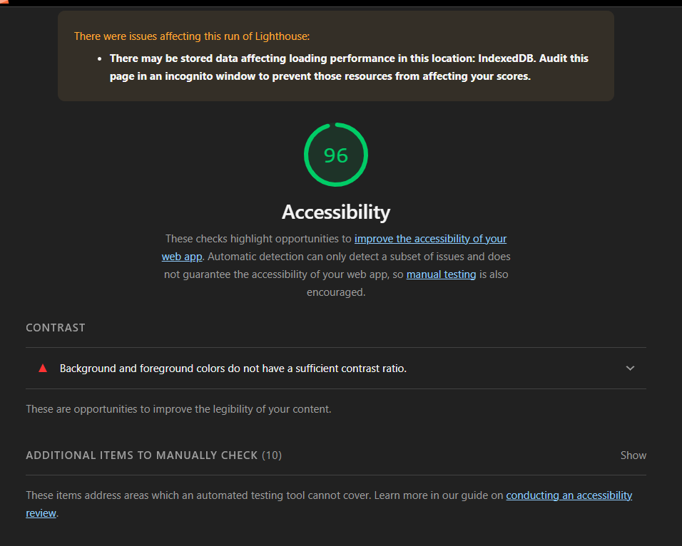

# Q1: Quels sont les arguments que vous pouvez utiliser pour convaincre votre Client de rendre son quizz accessible ? (Vous pouvez vous aider du cour)
Réponse:

D'un point de vue légal, l'accessibilité est une obligation. Le respect des directives WCAG 2.1 et la loi Handicap française évitent les risques juridiques.

Sur le plan commercial, environ 1 personne sur 5 a une limitation quelconque, représentant un marché potentiel important. L'accessibilité élargit la base d'utilisateurs et permet d'accéder à des appels d'offres publiques.

L'accessibilité renforce la réputation de l'entreprise en démontrant une responsabilité sociétale et fidélise une clientèle sensible à l'inclusion.

Techniquement, les pratiques d'accessibilité (textes alternatifs, HTML sémantique) améliorent le SEO et le classement dans les moteurs de recherche.

L'accessibilité bénéficie à TOUS les utilisateurs, pas seulement aux personnes handicapées, avec une meilleure navigation et maintenabilité du code.

Opérationnellement, elle réduit les bugs et facilite la maintenance long terme, tout en diminuant le support client.

# Q2: Ajouter le screen de votre score :
Screen:

# Q3: Est-ce que l'analyse de Lighthouse est suffisante pour évaluer l'Accessibilité de votre Application ?
Réponse:
Non. Lighthouse détecte les problèmes évidentes (alt-text, labels, contraste) mais pas les tests manuels (clavier, lecteur d'écran, ARIA) ni l'expérience utilisateur réelle.

# Q4: Combien de fois vous devez utiliser une touche du clavier pour passer le quizz ?
Réponse:  Aucune

# Q5: Donner 3 roles ARIA et 3 propriété ARIA
Réponse:

Rôles ARIA :
 En-tête du site
 Bouton cliquable
 Navigation

Propriétés ARIA:
 Description lisible pour l'utilisateur
 Masque un élément des lecteurs d'écran
 Indique si un élément est désactivé

# Q6: Ajouter le screen de votre score Lighthouse
Screen:

# Q7: L'une des best practice de l'ARIA est "ne pas utiliser l'ARIA" pouvez nous expliquer pourquoi d'après vous ?
Réponse:

Parce que les éléments HTML sémantiques (button, nav, h1-h6, article, section,..) embarquent déjà les rôles et propriétés ARIA appropriés. Il est préférable de les utiliser plutôt que d'ajouter ARIA manuellement.
ARIA doit être utilisé seulement quand le HTML sémantique ne suffit pas. C'est plus propre.

# Q8: Ajouter le screen de votre score Lighthouse
Screen:

# Q9: Pourquoi le score de lighthouse n'a pas augmenté d'après vous ?
Réponse: Parceque justement HTML sémantique suffisait et ce qui reste pour faire augmenté le score de l'accessibilité est de changer les couleurs du background et foreground comme bien mentionné

# Q10: Quel est la valeur du rapport de contraste actuel :
Réponse:

# Q11: Quel est la valeur du score AA :
Réponse:

# Q12: Quel est la valeur du score AAA :
Réponse:

# Q13: Comment pouvez vous changer la valeur du contraste de votre texte ?
Réponse:

# Q14: Ajouter le screen de votre score Lighthouse
Screen:

# Q15: Êtes vous capable de déterminer visuellement ce qui est un lien ou pas en appliquant chaque altérations ?
Réponse:

# Q16: Ajouter le screen de votre score Lighthouse
Screen:

# Q17:  Proposition 1
Description:
Nb d'actions gagnée : 

# Q18:  Proposition 2
Description:
Nb d'actions gagnée : 

# Q19:  Proposition 3
Description:
Nb d'actions gagnée : 
